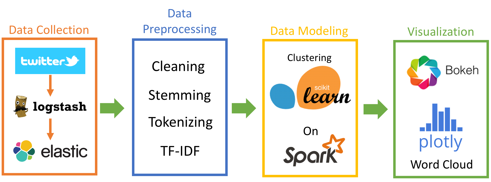

# Twitter Panama Papers Analysis
This project is using the Logstash to get data from Twitter. Then use the PySpark K-Means algorithm to clustering.

##Architecture

##Environment
* Anaconda version: 4.0.8
* Python version: 2.7.11 
* iPython version: 4.1.2
* Spark version: 1.5.2
* NLTK version: 3.2
* Pandas version: 0.18.1
* Scikit-learn version: 0.17.1
* Snow Ball Stemmer version: 1.2.1
* Bokeh version: 0.11.1
* Logstash version: 2.3.1
* Elasticsearch version: 2.3.1
* JAVA Version 8 Update 77

##Data Collection
* Logstash to Elasticsearch ([Twitter Streamming API](https://dev.twitter.com/rest/public)) 
(Note: You can use the Python to crawl the data, it use the [Twitter REST API](https://dev.twitter.com/rest/public). Reference code is available in my Github [repository](https://github.com/toyota790/Twitter2JSON).)
* Data Format: CSV
* Search Keyword:
<ol>
	<li>"#panamapapers"</li>
	<li>"panamapapers"</li>
	<li>"panama paper"</li>
	<li>"the panama paper"</li>
</ol>

##Data Source
* 514 attributes
* Data Size
	* Total: 200000 (484 MB)
	* Training dataset: 20000
* Time
	* Start: Sun Apr 10 16:18:35 +0000 2016
	* End: Wed Apr 13 18:32:27 +0000 2016

##Data Cleaning
* URL
	* https, http
* Emoji
	* UCS-4, UCS-2
* Alphabet
	* a, c, l, etc.
* Stop word
	*  NLTK’s list of English stop words
* Punctuation
	* dot, question mark, etc.
##Feature Selection
* Stemming
	* Panamapapers -> panamapap
	* Family -> famili
	* Link -> link
* Tokenizing 
* TF-IDF
	* 2000 features

##Data Modeling
* K-means++ Clustering Algorithm
	* K=4
* The size of each cluster:
	* Cluster 0: 5158
	* Cluster 1: 964
	* Cluster 2: 13233
	* Cluster 3: 645

##Visualization
* Bokeh (Two dimensions)
![Bokeh Result] (Result/Bokeh_Result.png)

* Word Cloud - Cluster 0
![Word Cloud Cluster 0] (Result/WordCloud_cluster0.png)

* Word Cloud - Cluster 1
![Word Cloud Cluster 1] (Result/WordCloud_cluster1.png)

* Word Cloud - Cluster 2
![Word Cloud Cluster 2] (Result/WordCloud_cluster2.png)

* Word Cloud - Cluster 3
![Word Cloud Cluster 3] (Result/WordCloud_cluster3.png)

* Plotly (Three dimensions)
![Plotly Result] (Result/Plotly_Result.png)
